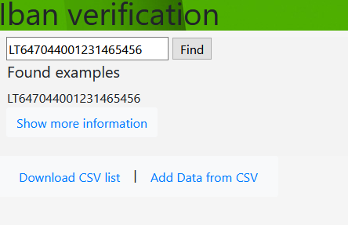
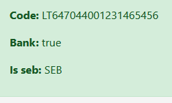

# README
Rails REST web-service to validate IBANs.

Try app yourself which is deployed [here](https://ibanvalidation.herokuapp.com/.)

# How to use
* Service already has some example values (from task) stored inside database.
* Data can be added only from csv file without header(like in example), to add more data click `Add data from CSV` button, choose file (.csv extension) and click 
`Add data to database` button.
* To download list of IBANs which validates IBAN and bank click `Download CSV file`
* To use Search just enter IBAN, if Iban exists it will show all info about it

#Note
I modified task a little bit.

So that there is only one service which does all the job. Exported csv displays both of required values(IBAN validation, BANK) which I think is way more efficient.
Data is stored inside database but can be ADDed with file. IBANs are unique which can not dublicate.

#Sneak peak photos:
 
 

